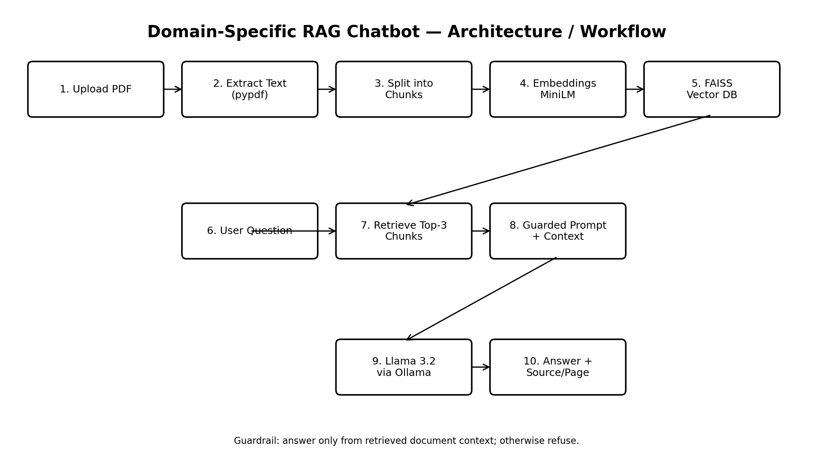

# Domain-Specific RAG Chatbot for PDF Question Answering

## Project Overview

This project is a Domain-Specific Retrieval-Augmented Generation (RAG) chatbot.

The chatbot allows users to upload a PDF and ask questions about its content.

The system retrieves relevant information from the uploaded PDF and uses a local Large Language Model (LLM) to generate an answer.

The chatbot also displays the source PDF and page number.

---

## Objective

The main objectives of this project are:

- Extract text from PDF documents.
- Split the text into smaller chunks.
- Convert text chunks into embeddings.
- Store embeddings using FAISS.
- Retrieve relevant information for a question.
- Generate answers using the retrieved context.
- Show the source document and page number.
- Refuse to answer when the information is not available in the document.

---

## Technologies Used

- Python
- Streamlit
- PyPDF
- LangChain
- Sentence Transformers
- FAISS
- Ollama
- Llama 3.2

---

## RAG Workflow

The system follows these steps:

1. User uploads a PDF.
2. Text is extracted from the PDF.
3. Text is divided into chunks.
4. Embeddings are generated for the chunks.
5. Embeddings are stored in FAISS.
6. User asks a question.
7. Relevant chunks are retrieved.
8. Retrieved context is sent to the LLM.
9. The LLM generates an answer.
10. The source document and page number are displayed.


---

## Project Structure

```text
domain_rag_chatbot/
│
├── documents/
│
├── vector_store/
│
├── tests/
│   └── test_questions.csv
│
├── app.py
├── document_loader.py
├── rag_pipeline.py
├── vector_store.py
├── prompt.py
├── llm.py
├── README.md
└── requirements.txt